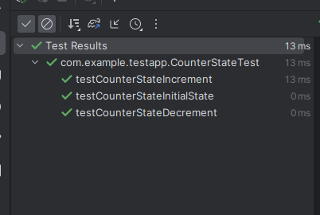

# CI/CD for Android projects - A vendor agnostic way

[](https://github.com/anandbosedev/android-ci-demo/actions/workflows/main.yml) [](https://gitlab.com/anandbose/android-ci-demo) [](https://dev.azure.com/anandbose/android-ci-demo/_build/latest?definitionId=1&branchName=main)

This project aims to be a "vendor agnostic" template of CI/CD implementation for Android projects.
The term "vendor agnostic" refers to the practice of implementing something with commonly available, open source
and well documented tools that does not restrict the implementation to a particular vendor.

Advantages of being vendor-agnostic:

* Freedom to use the tools of your choice.
* No vendor lock-in.
* Easier migration to other vendors.
* Ability to test your CI/CD in your local machine.
* Reproducibility: If your script works in your local machine, it works in the cloud too.

Most of the DevOps solutions offers these generic barebone functionalities:
* Ability to pull docker images and create a working environment inside the container.
* Ability to transfer repository to the container, execute the building scripts, testing scripts and collect build artifacts.
* Ability to cache build intermediates to speed up subsequent builds.

In this project, we use a container image with pre-configured Android SDK toolchain [anandbose16/android-sdk](https://hub.docker.com/r/anandbose16/android-sdk) ([GitHub](https://github.com/anandbosedev/android-sdk)). The build-scripts
we write in the configuration files (the YAML files) can be reproducible in your local machine, so does in the cloud.
The project currently provides build & test configurations for GitHub, GitLab, BitBucket and Azure DevOps Pipelines, which
is capable for building the project and execution of unit tests. Execution of instrumented tests is currently limited to
GitHub only because other vendors does not provide access to hypervisor from the container.

## Demo

For the demostration purposes I made a simple "counter" app with JetPack Compose which looks like this:

|  |
| -- |
| *Screenshot of the app* |

In this project, we have unit tests `CounterStateTest` for testing the `CounterState` class, the stateholder of the application with `increment()` and `decrement()` mutating methods. Also we have instrumented tests `CounterAppTest` to validate the application UI will interact properly with `CounterState` state class.

|  |
| -- |
| *Unit test execution in Android Studio* |

|  |
| -- |
| *Instrumented test execution in Android Studio* |

## Instrumented tests with Gradle managed devices

Gradle makes us easier to quickly spin up emulated devices with the required specifications. In the `app/build.gradle.kts`, we provide the specification of a medium sized phone and tablet. Also we create a device group with both devices included:

```kotlin
testOptions {
    managedDevices {
        localDevices {
            create("mediumPhoneApi34AospAtd") {
                device = "Medium Phone"
                apiLevel = 34
                systemImageSource = "aosp-atd"
            }
            create("mediumTabletApi34AospAtd") {
                device = "Medium Tablet"
                apiLevel = 34
                systemImageSource = "aosp-atd"
            }
        }
        groups {
            create("mediumPhoneAndTabletApi34AospAtd") {
                targetDevices.add(devices["mediumPhoneApi34AospAtd"])
                targetDevices.add(devices["mediumTabletApi34AospAtd"])
            }
        }
    }
}
```

This gives us a Gradle task `:app:mediumPhoneAndTabletApi34AospAtdGroupDebugAndroidTest` which builds the project, spins up the emulator instances with `aosp-atd` image (a light-weight image specifically for instrumentation testing) for both medium sized phone and tablet, executes the test cases and generate reports.

## Test automation workflow

For automating build generation and test execution, we use a pre-built Android SDK toolchain container image [anandbose16/android-sdk](https://hub.docker.com/r/anandbose16/android-sdk) ([GitHub](https://github.com/anandbosedev/android-sdk)) to minimise the setup time and simplifying the configuration. The container image meets the requirements for basic Android development environment such as Android SDK toolchain, Gradle, OpenJDK, emulator and basic command-line utilities for post tasks.

The ideal workflow:
1. Use the container image `anandbose16/android-sdk:34`
2. Checkout code
3. Generate build with `:app:assembleDebug` task
4. Execute lint with `:app:lintDebug` task
5. Execute unit tests with `:app:testDebugUnitTest` task
6. Execute instrumented tests with `:app:mediumPhoneAndTabletApi34AospAtdGroupDebugAndroidTest` task
7. Upload the APK file and the test reports to artifacts storage.

> Note: The implementation of the workflow is different on each platform, and platform implied limitations will apply.

| Platform | Repo | Configuration | Supports Build | Supports Lint | Supports Unit Tests | Support Instrumented Tests |
|----------|------|---------------|----------------|---------------|---------------------|----------------------------|
| GitHub | [Repo](https://github.com/anandbosedev/android-ci-demo) | [.github/workflows/main.yml](.github/workflows/main.yml) | ✅ | ✅ | ✅ | ✅ |
| GitLab | [Repo](https://gitlab.com/anandbose/android-ci-demo) | [.gitlab-ci.yml](.gitlab-ci.yml) | ✅ | ✅ | ✅ | ⛔<sup>[1]</sup> |
| BitBucket | [Repo](https://bitbucket.org/anandbose/android-ci-demo) | [bitbucket-pipelines.yml](bitbucket-pipelines.yml) | ✅ | ✅ | ✅ | ⛔<sup>[2]</sup> |
| Azure DevOps | [Repo](https://dev.azure.com/anandbose/android-ci-demo) | [azure-pipelines.yml](azure-pipelines.yml) | ✅ | ✅ | ✅ | ⛔<sup>[3]</sup> |

> <sup>[1][2]</sup> *Running emulators in GitLab and BitBucket pipelines are not supported due to lack of [KVM](https://developer.android.com/studio/run/emulator-acceleration#vm-linux) hypervisor.*<br>
<sup>[3]</sup> *Running emulators in Azure is not supported due to lack of [KVM](https://developer.android.com/studio/run/emulator-acceleration#vm-linux) hypervisor support. However, you can refer to the [official solution](https://learn.microsoft.com/en-us/azure/devops/pipelines/ecosystems/android?view=azure-devops) which uses macOS host which can run Android
emulator and perform instrumented tests (Kindly note this configuration is not vendor agnostic).*

#### *Feel free to send comments, suggestions, issues and pull requests!*